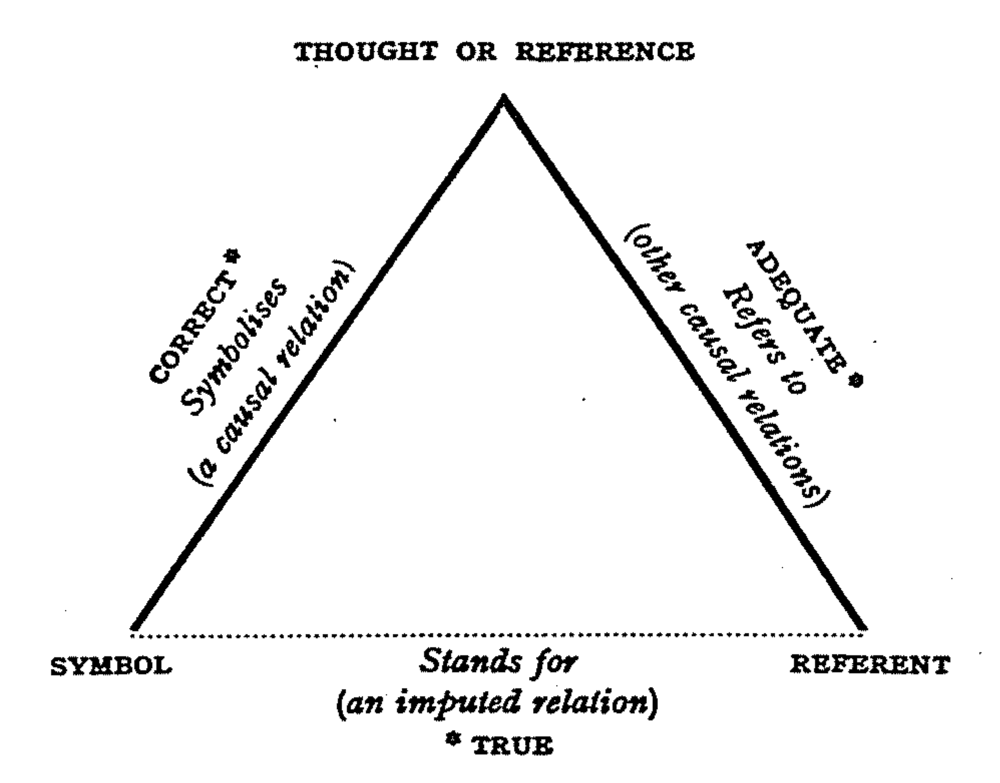

# Enguage - Basic Principles

Enguage attempts to reflect the conventional mapping of words uttered
to those replied.
This convention is based on the idea that we think in utterances,
and it is directed by our reaction to those thoughts.

utterance --> {thoughts} --> {replies}  
------ felicity ------->

## Utterance
Thoughts and replies are just utterances. An utterance is just any string 
of words, there is no need for it to conform to any syntax - this is 
arbtrary mapping.

## Thought
Thoughts are unspoken utterances, used to interpret utterances, and are 
interpreted themsleves.

## Reply
A reply is a formatted answer. A different reply (format) will be provided
at each level of interpretation.

### Answer
An answer will be passed up, verbatim, through the interpretation (layers 
of thought.) 

## Felicity
Underlying the interpretation of thoughts is the felicity, or happiness, 
of their reply. If a reply is infelicitous, interpretation proceeds on the 
thoughts that are preceded with "if not, "; felicitous replies can be,
but are not necessarily, prefixed by "if so, ".

## Acknowledgements:
+ U-T-R: is essentially the Triadic Sign model, of Sign, Object and Interpretant
by Charles Sanders Peirce (1839-1914), as illustrated by C. K. Ogden and 
I. A. Richards in their 1923 publication, The Meaning of Meaning.

Fig. 1. The Semiotic Tringle, c/f The Meaning of Meaning, 1923.

+ Felicity - was introduced by John Langshaw Austin, in his 1955 
William James Lectures at Harvard University, Boston, MA. 
This was taken up and advances as Speech Act Theory by John Searle.

## Papers
+ 2007 - Semiotic Distance - describing the 'depth' of understanding.
+ 2011 - Semiotc Model of IS - a conversational model if information systems.
+ 2013 - If we are holding hands... - the first comprehensive example.
+ 2014 - Autopoietic Repertoire - how to self-generate information systems.
+ 2016 - Disambiguation - a vocal mechanism.
+ 2018 - Programming without Program - Vocal programming.
+ 2018 - Because and Why - Advanced example of vocal reasoning.
+ 2019 - Pronoun disabmiguation - Winograd Schema Challenge example.

Plus many more available on [ReserchGate.org](https://www.researchgate.net/profile/Martin_Wheatman) and
[Academia.com](https://reading.academia.edu/MartinJWheatman)
